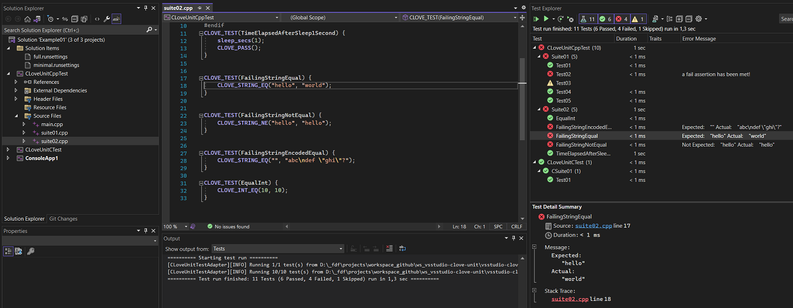
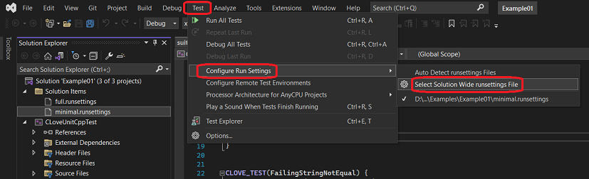

# CLove-Unit Test Adapter for Visual Studio

[](https://marketplace.visualstudio.com/items?itemName=fdefelici.vs-clove-unit) [](https://marketplace.visualstudio.com/items?itemName=fdefelici.vs-clove-unit)


CLove Unit Test Adapter is a Visual Studio extension providing discovery and execution if C/C++ tests written with [CLove-Unit](https://github.com/fdefelici/clove-unit).



<br />

> Still don't know about [CLove-Unit](https://github.com/fdefelici/clove-unit) testing library?<br />
> It's a Single Header Unit Testing library for C/C++ language, which make easy developer life. Give it a try! ;-)

## Features
* Support CLove-Unit library v2.3.X
* Support Visual Studio version: 2022 (aka v17.x)
* Tests discovery/execution for ```Test Explorer```
* Test console output displayed on test detail panel (only when running a single test)
* Configuration throught standard ```Run Settings``` files
* Tests discovery by custom regex  
* Automation support by ```VSTest.Console.exe```
 
# Adapter Usage
## Activation
By default, the adapter is in a disabled state. This to prevents discovery mechanism from running on non-CLove-Unit executables. 

In order to activate the adapter:
1. First, you need to create a *C++ Console Application* Project and implement your tests using `CLove-Unit` library [guidelines and samples](https://github.com/fdefelici/clove-unit). (This adapter doesn't include CLove-Unit library)
1. Then, add a *Run Settings* configuration for ***CLove-Unit Test Adapter***  (see adapter [Configuration](##configuration))
1. Finally, select the *Run Settings* file from Visual Studio menu *"Test -> Configure Run Settings"* and then run tests from *Test Explorer* (see adapter [Execution](##execution))

## Configuration
The Adapter needs that a Run Settings file is defined. The file is expected to have ```.runsettings``` extension (but can have any name, even empty) and placed at Solution level (even in subfolders).

> NOTE: Run Settings is standard way to define test adapter configuration foresees by Visual Studio Test Framework. More details can be found [here](https://learn.microsoft.com/en-us/visualstudio/test/configure-unit-tests-by-using-a-dot-runsettings-file?view=vs-2022).

Here a minimal configuration example:

```xml
<?xml version="1.0" encoding="utf-8"?>
<RunSettings>
  
  <!-- Adapter specific tag -->
  <CLoveUnit>
    <!-- Select executable whose filename ends with "Test" -->
    <ExecNameRegex>.*Test$</ExecNameRegex> 
  </CLoveUnit>

</RunSettings>
```

Here a Run Settings example with the complete list of settings available for the adapter:

```xml
<?xml version="1.0" encoding="utf-8"?>
<RunSettings>

  <CLoveUnit>
    <AdapterEnabled>true</AdapterEnabled>
    <DebugEnabled>false</DebugEnabled>
    <ExecNameRegex>.*Test$</ExecNameRegex>
  </CLoveUnit>

</RunSettings>
```

|Tag|Required|Description|
|--------|-----------|----------|
| `CLoveUnit` | yes | Root node for the adapter configuration |
| `AdapterEnabled` | no | Explicitly enable/disable the adapter {`true`, `false`}. Default is `true`.|
| `DebugEnabled` | no | Enable/disable debug messages {`true`, `false`}. Default is `false`. |
| `ExecNameRegex` | yes | Regular expression (C# based) applied to test executable filenames for selecting the ones for tests discovery and execution. |


## Execution
Once you have your Run Settings file ready:
1. Just select it once from menu *"Test -> Configure Run Settings"* (see image below)
1. Open the *"Text Explorer"* view (if not already opened) fro menu *"Test -> Test Explorer"*
1. Click on Play button of the *"Test Explorer"* view (or eventually "Run All Tests" from "Test" menu)



<br />

> NOTE: In case Test Adapter doesn't discover any tests or doesn't apply latest Run Settings configuration, try to Clean/Build the test project(s) in order to force *Test Explorer* to update its internal cache.


# Example
A project example is available in the [Examples](./Examples) folder where a CLove-Unit test project is configured with both *minimal* and *full* Run Settings files.

# Changelog
History of changes [here](./CHANGELOG.md).